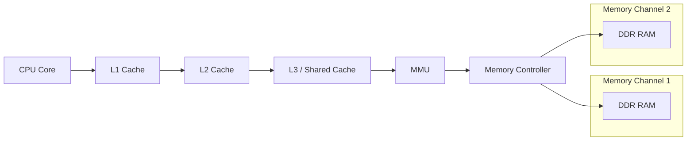
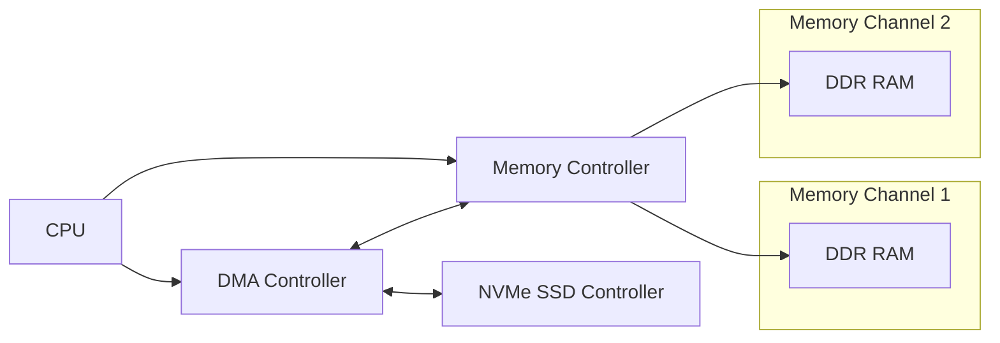
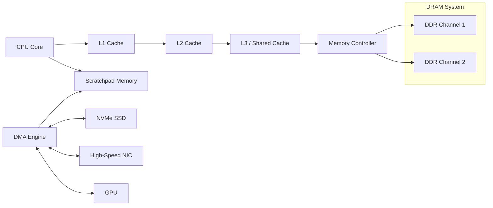
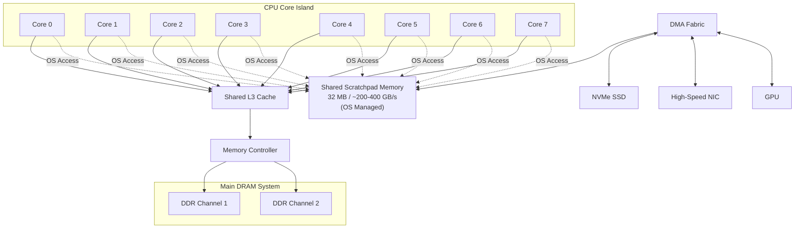

# Scratchpad Memory Domains for Traffic-Isolated CPU Architectures

Last Update: 25/05/2026 - Julien BOUCARON

## Introduction

Modern computer systems are increasingly limited not by raw compute throughput, but by memory-system interference. CPUs, GPUs, NVMe storage devices, high-speed network controllers, and accelerators all compete for access to shared DRAM through increasingly complex cache-coherent fabrics. While compute throughput has scaled rapidly, memory bandwidth, latency stability, and cache efficiency have improved much more slowly.

The result is not necessarily insufficient average bandwidth, but rather unstable latency and unpredictable contention under mixed workloads.

This document explores an architectural direction based on **traffic-isolated scratchpad memory domains** managed primarily by the operating system. The objective is not to replace DRAM or CPU caches, but to introduce a dedicated high-throughput memory plane optimized for burst-oriented DMA traffic and heterogeneous I/O activity.

The core idea is simple:

> Separate burst-heavy I/O traffic from the coherent DRAM and cache hierarchy in order to reduce contention, cache pollution, and latency variability.

This architecture builds upon concepts already partially present in modern systems — DMA offloading, GPU local memory, staging buffers, SmartNIC SRAMs, pinned memory regions, and accelerator-local memory — but proposes a more unified and OS-visible memory-domain model.

---

# The Real Problem: Memory Traffic Interference

Modern systems suffer from a specific pathology:

## Memory “Noise”

The issue is often not peak memory bandwidth, but interference caused by highly variable traffic patterns:

* NVMe burst transfers
* GPU memory staging
* NIC packet storms
* DMA-heavy workloads
* page-cache churn
* accelerator synchronization traffic

These behaviors create several forms of instability:

* cache pollution, especially in shared L3 caches
* DRAM row-buffer conflicts
* memory-controller contention
* latency spikes
* QoS degradation under mixed workloads
* unpredictable tail latency

As systems become increasingly heterogeneous, DRAM becomes the primary mixing point for unrelated traffic classes.

Even when average bandwidth remains sufficient, latency predictability degrades significantly.

---

# Why Existing Cache Hierarchies Struggle

Traditional CPU memory systems are optimized primarily around coherent shared memory.

A simplified modern CPU hierarchy looks like this:

This model works well for traditional CPU-centric workloads, but modern systems increasingly include:

* multiple GPUs
* high-speed NICs
* NVMe SSD arrays
* AI accelerators
* DMA-intensive storage pipelines

All of these components compete for shared memory resources.

The coherent DRAM domain becomes both:

* a capacity layer
* and a traffic synchronization point

This creates increasing pressure on:

* memory controllers
* cache hierarchies
* coherence fabrics
* DRAM scheduling logic

---

# DMA and the Rise of Memory-Centric I/O

Direct Memory Access (DMA) engines already allow devices to transfer data independently from CPU execution.

DMA significantly improves system throughput because devices can operate concurrently with CPU execution.

However, DMA does not eliminate pressure on the memory subsystem. In practice, it often increases contention because:

* devices inject burst-oriented traffic directly into DRAM
* CPU caches become polluted by streaming transfers
* memory-controller arbitration becomes more complex

As modern systems offload more work from CPUs toward devices and accelerators, the memory subsystem increasingly becomes the bottleneck.

---

# Existing Partial Solutions

Many modern systems already implement partial forms of traffic isolation.

Examples include:

* GPU local memory and shared memory
* SmartNIC packet SRAMs
* NVMe controller SRAM staging buffers
* DPDK hugepage networking
* io\_uring fixed buffers
* GPUDirect-style DMA paths
* accelerator-local HBM memory
* NUMA-local DMA regions
* console ESRAM architectures
* on-package SRAM fabrics
* coherent and non-coherent accelerator memory

Modern interconnect standards such as
Compute Express Link Consortium
also move toward heterogeneous memory-domain architectures through:

* memory pooling
* accelerator-attached memory
* fabric-attached memory devices
* memory tiering

However, these mechanisms remain fragmented and highly device-specific.

There is currently no unified architecture that exposes traffic-oriented memory isolation as a first-class operating-system concept.

---

# Scratchpad Memory as a Traffic-Isolated Domain

Scratchpad memory is not a new concept.

Scratchpads already exist in:

* DSPs
* GPUs
* embedded systems
* FPGA accelerators
* coarse-grain reconfigurable architectures

Traditionally, scratchpads are:

* small
* software-managed
* explicitly addressed
* optimized for predictable low-latency access

The proposal here differs from classical DSP scratchpads.

The scratchpad is not intended primarily as:

* a manually programmed compute-local memory
* or a cache replacement

Instead, it acts as:

> a high-bandwidth staging and buffering domain specialized for DMA-heavy burst traffic.

---

# Proposed Architecture

The architecture introduces a second memory plane alongside coherent DRAM.

## Coherent DRAM Domain

The traditional memory domain remains responsible for:

* application working sets
* virtual memory
* cache-coherent execution
* memory capacity

## Scratchpad Domain

The scratchpad domain is optimized for:

* DMA staging
* burst absorption
* packet buffering
* accelerator transfers
* transient high-bandwidth traffic

The key idea is not increasing total memory capacity.

The objective is:

> physical separation of traffic classes.

The scratchpad acts as a transient burst absorber that prevents highly variable DMA traffic from constantly perturbing the coherent DRAM hierarchy.

---

# Memory QoS Through Traffic Separation

This architecture is fundamentally about memory Quality of Service (QoS).

The objective is to isolate:

* burst-oriented I/O traffic
* streaming transfers
* accelerator synchronization activity

from:

* CPU working sets
* latency-sensitive cache traffic
* coherent execution paths

This can improve:

* latency stability
* tail latency
* cache efficiency
* DRAM scheduling predictability
* QoS under mixed workloads

The architecture does not necessarily reduce total traffic.

Instead, it attempts to reduce destructive interference between unrelated traffic classes.

---

# OS-Orchestrated Scratchpad Management

The operating system becomes responsible for managing the scratchpad as a distinct non-coherent memory domain.

The scratchpad is not treated as ordinary RAM.

Instead, it behaves more like:

* a traffic-managed staging plane
* a DMA-oriented buffering system
* an isolated I/O memory domain

The OS becomes responsible for:

* region allocation
* ownership tracking
* synchronization
* DMA scheduling
* traffic isolation
* memory QoS policies

Because the scratchpad is non-coherent, synchronization must be explicit:

* barriers
* flushes
* invalidations
* ownership transfers

Device drivers communicate expected traffic semantics:

* streaming
* burst-oriented
* latency-sensitive
* bulk-transfer behavior

This allows the OS to orchestrate memory traffic more intelligently across multiple domains.

The operating system is no longer only managing memory capacity.

It also becomes responsible for:

> memory traffic orchestration.

---

# Architectural Properties

| Property           | DRAM Domain            | Scratchpad Domain |
| ------------------ | ---------------------- | ----------------- |
| Cache coherent     | Yes                    | No                |
| Capacity optimized | Yes                    | No                |
| Latency optimized  | Moderate               | Yes               |
| DMA optimized      | Shared                 | Primary purpose   |
| User visible       | Yes                    | Typically hidden  |
| CPU cacheable      | Yes                    | Optional          |
| Burst absorption   | Poor                   | Strong            |
| Predictability     | Lower under contention | Higher            |
| Synchronization    | Implicit coherence     | Explicit barriers |

---

# Affordable Implementation Model

A practical implementation could use:

* 4–8 CPU cores
* shared non-coherent scratchpad
* DMA-attached SRAM plane
* operating-system-managed buffering

For example:

* 32 MB shared scratchpad SRAM
* 200–400 GB/s local bandwidth
* DMA-accessible
* non-coherent
* not directly exposed to user space

This architecture behaves similarly to a modernized northbridge staging layer integrated directly into the CPU island.

---

# Workloads That Benefit Most

## High-Performance Networking

DPDK-style networking systems are highly sensitive to:

* packet bursts
* cache pollution
* tail latency

Traffic isolation could significantly improve QoS stability.

---

## Storage Systems and Databases

NVMe-heavy systems often experience DRAM contention during:

* logging
* replication
* compaction
* asynchronous flushes

Scratchpad staging could absorb burst behavior before data reaches DRAM.

---

## Real-Time Systems

Robotics, automotive, avionics, and industrial-control systems benefit from:

* deterministic latency
* bounded memory interference
* predictable synchronization behavior

---

## Media Pipelines

Video capture, encoding, and streaming systems naturally produce burst-oriented traffic patterns that are poorly matched to coherent cache hierarchies.

---

## Game Engines

Asynchronous asset streaming frequently creates:

* frame-time spikes
* cache disruption
* DRAM bursts

Traffic isolation may improve frame pacing stability.

---

## AI and Accelerator Pipelines

Inference systems frequently perform:

* tensor staging
* preprocessing
* accelerator synchronization

Scratchpad domains may reduce cache pollution from transient transfers.

---

# Limitations and Challenges

This architecture introduces significant complexity.

## OS Complexity

The operating system must implement:

* traffic classification
* DMA scheduling
* ownership tracking
* synchronization orchestration
* backpressure handling
* QoS enforcement

This resembles:

* packet scheduling
* accelerator runtime management
* heterogeneous memory orchestration

rather than traditional memory allocation.

---

## Limited Capacity

Scratchpad memory is fundamentally capacity-constrained.

A 32 MB scratchpad cannot replace DRAM.

It primarily acts as:

* a transient burst absorber
* a staging layer
* a traffic isolation buffer

Poor scheduling could simply move congestion from DRAM into the scratchpad itself.

---

## Synchronization Costs

Non-coherent memory requires:

* explicit synchronization
* barriers
* invalidations
* ownership transfer protocols

This introduces software complexity and potential latency overhead.

---

## Programming Model Complexity

Direct user-space exposure of scratchpad memory would require:

* explicit consistency semantics
* new APIs
* runtime cooperation
* security isolation
* compiler support

For this reason, the most realistic early implementation is likely:

* OS-managed
* driver-oriented
* mostly hidden from applications

---

# Future Directions

Several directions could extend this architecture.

## ISA Support

Future ISAs could expose:

* non-coherent memory semantics
* DMA-aware synchronization primitives
* explicit ownership-transfer instructions
* traffic-aware memory operations

Open architectures such as
RISC-V International
may provide flexibility for experimentation.

---

## User-Space Scratchpad Access

Advanced runtimes could benefit from controlled scratchpad access:

* networking stacks
* storage engines
* accelerator runtimes
* low-latency systems

This would require strict OS-managed synchronization and protection boundaries.

---

## Multiple Specialized Memory Domains

Future systems may evolve toward:

* multiple scratchpad regions
* different bandwidth tiers
* different latency classes
* workload-specialized memory domains

This could resemble a heterogeneous hierarchy of:

* coherent DRAM
* burst-oriented SRAM
* accelerator-local memory
* fabric-attached memory
* near-compute memory regions

---

## Near-Scratchpad Compute

Accelerators and specialized processing units could eventually be placed directly adjacent to scratchpad domains, reducing:

* cache pressure
* DRAM traffic
* synchronization overhead

This would extend the architecture toward a broader heterogeneous compute model.

---

# Conclusion

Modern systems increasingly suffer from memory interference rather than purely insufficient bandwidth.

The central problem is that coherent DRAM has become the primary convergence point for:

* CPU execution
* DMA traffic
* GPU transfers
* NVMe bursts
* networking activity
* accelerator synchronization

This creates:

* cache pollution
* memory-controller contention
* unstable latency
* degraded QoS under mixed workloads

The architecture proposed here introduces a traffic-isolated scratchpad memory domain managed primarily by the operating system.

The objective is not to replace DRAM or caches, but to physically separate burst-heavy I/O traffic from coherent CPU working sets.

The most important idea is therefore not scratchpad memory itself.

It is:

> treating memory traffic isolation as a first-class architectural concern.

While the hardware addition is relatively evolutionary — a simpler, denser, non-coherent SRAM plane that acts as a burst damper and accelerator hub — the real work lies in the operating system. Significant changes are required in memory management, DMA subsystems, buffer allocation, ownership tracking, synchronization primitives, and traffic-aware scheduling. In contrast, the ISA and compiler impact can remain minimal, especially in an initial OS-managed implementation.

As systems continue evolving toward increasingly heterogeneous and accelerator-heavy designs, memory-domain specialization and traffic-oriented orchestration may become necessary components of future high-performance computing architectures. The hardware is feasible today; the deeper challenge — and opportunity — is evolving the OS to treat memory traffic as a first-class resource that must be actively orchestrated, not just passively allocated.